# Copypast - iOS Pano Yöneticisi

Copypast, iOS cihazlar için geliştirilmiş modern ve kullanıcı dostu bir pano yönetim uygulamasıdır. Kopyaladığınız metinleri otomatik olarak kaydeder ve istediğiniz zaman tekrar kullanmanıza olanak sağlar. Hem aydınlık hem de karanlık mod desteği ile göz yormayan bir deneyim sunar.

## 📱 Ekran Görüntüleri

<p align="center">
  
  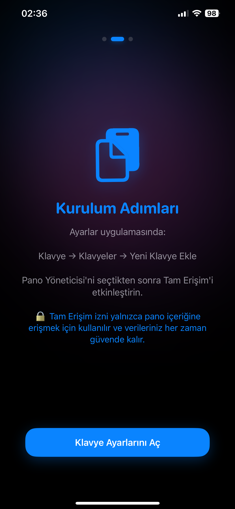
  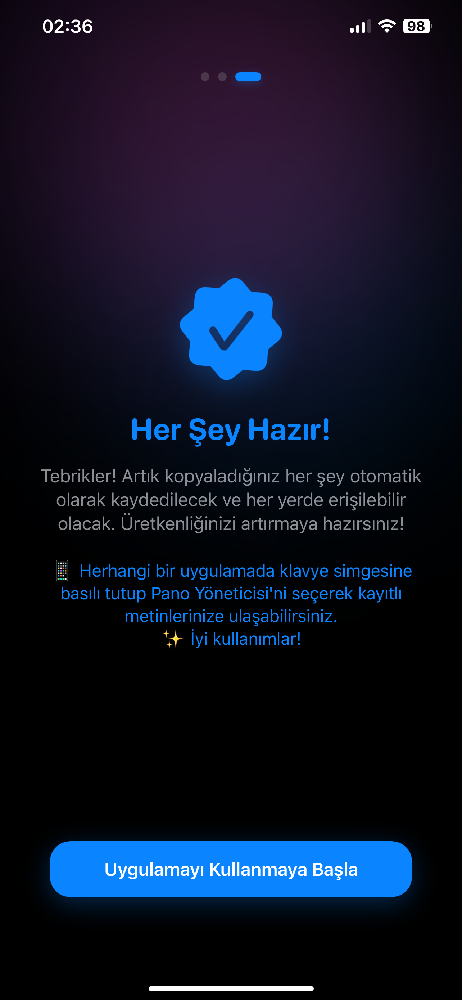
</p>

<p align="center">
  
  
  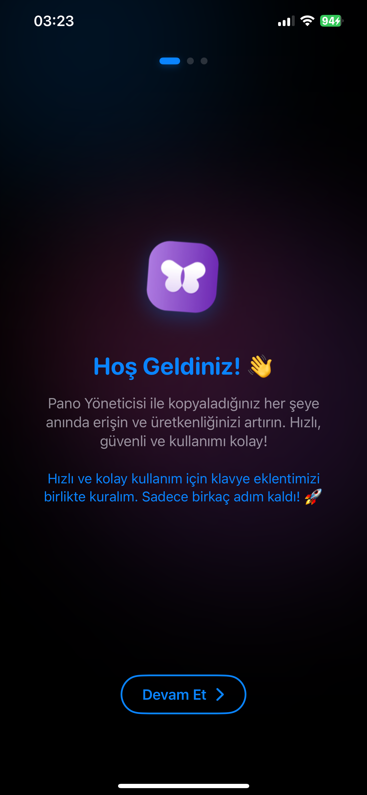
</p>

<p align="center">
  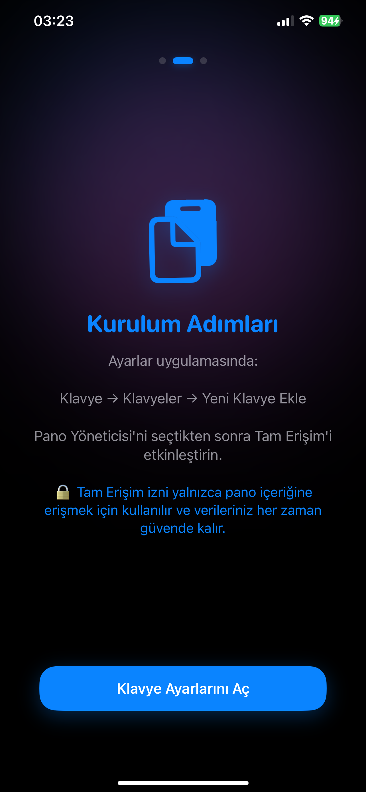
  
  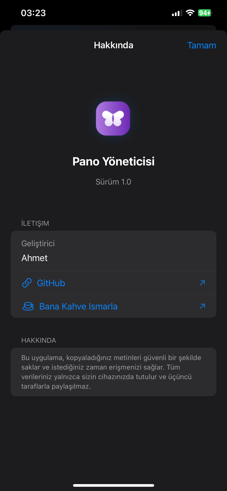
</p>

<p align="center">
  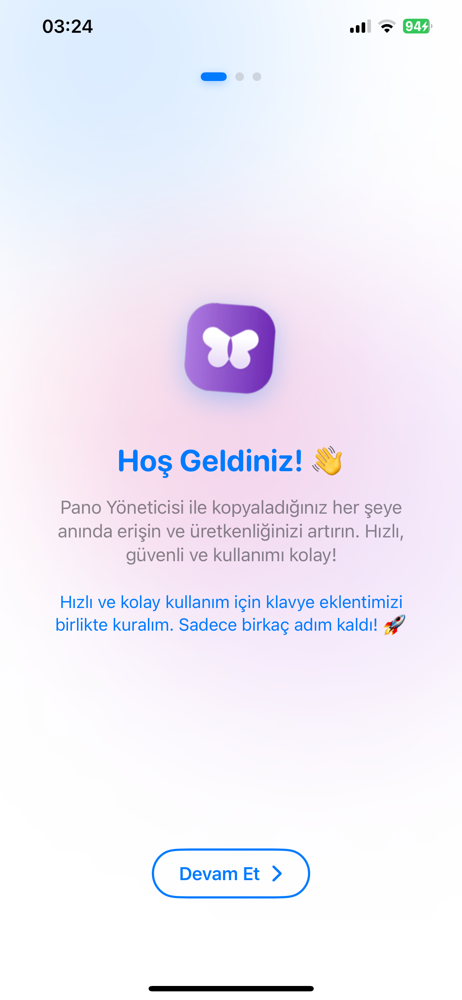
  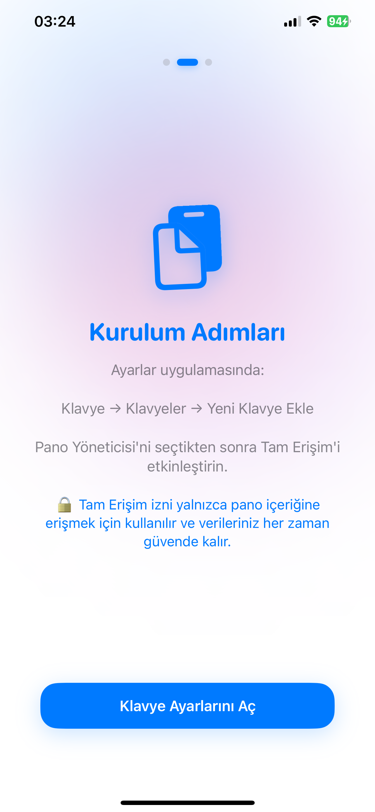
  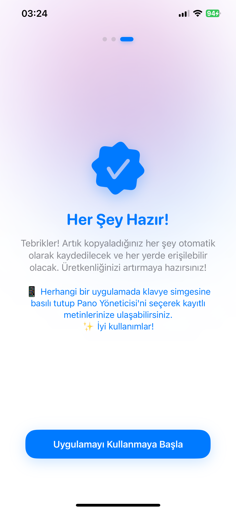
</p>

<p align="center">
  
  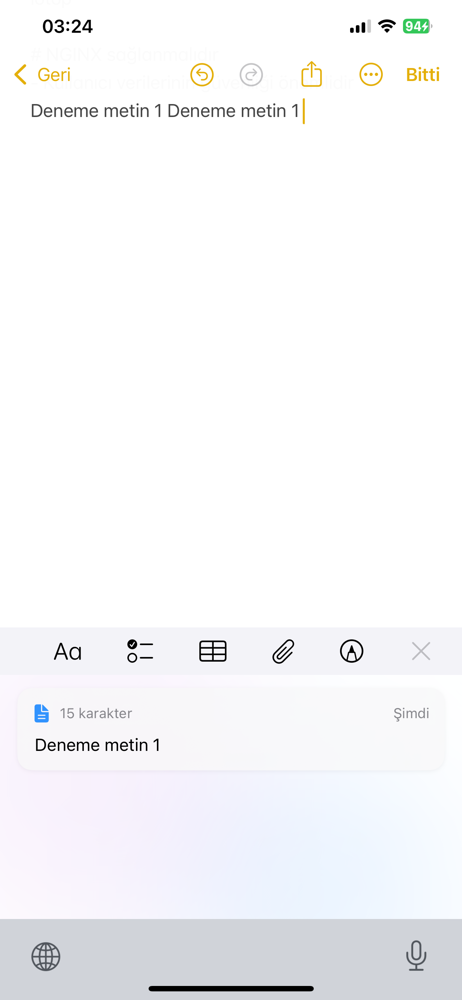
  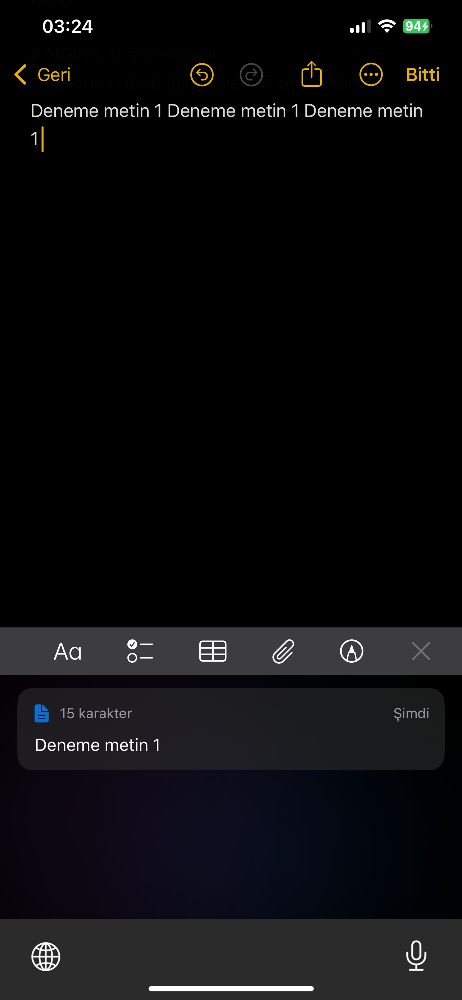
</p>

<p align="center">
  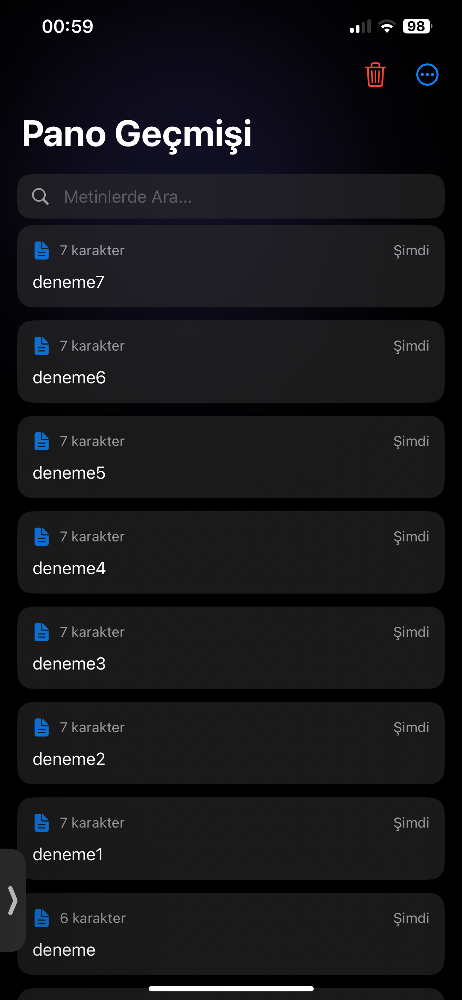
  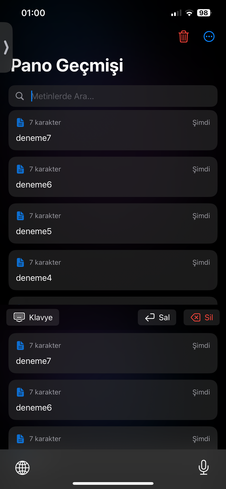
  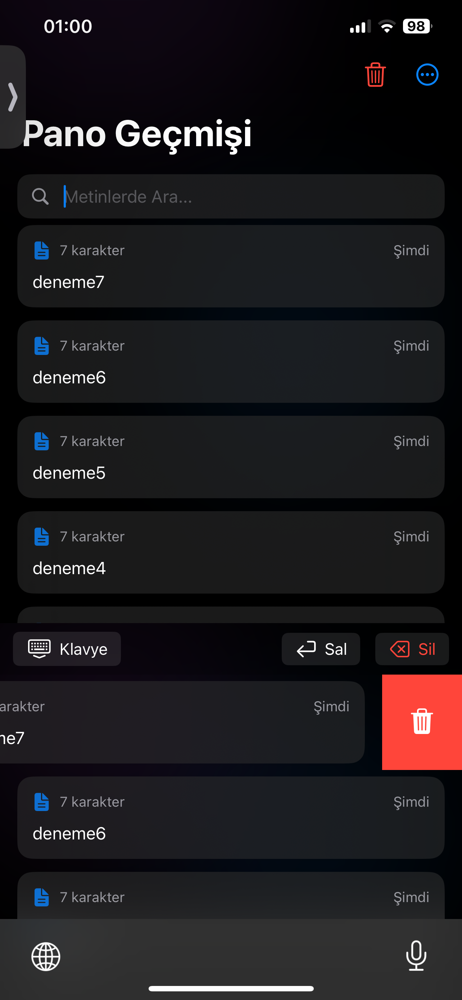
</p>

## ✨ Özellikler

- 📋 Otomatik pano takibi ve anlık kayıt
- 📱 Özel klavye uzantısı ile hızlı erişim
- 🔍 Metin arama ve filtreleme
- 📌 Önemli metinleri sabitleme
- 🗑️ Kaydırarak silme ve düzenleme
- 🌙 Aydınlık/Karanlık mod desteği
- 🔄 Kolay erişim ve yeniden kullanım
- 🔒 Gizlilik odaklı yerel depolama

## 📱 Kullanım Videosu

<p align="center">
  
</p>

## 📱 Kurulum

1. Projeyi klonlayın:
   ```bash
   git clone https://github.com/AhmetShbz/Copypast.git
   ```

2. XcodeGen'i yükleyin (eğer yüklü değilse):
   ```bash
   brew install xcodegen
   ```

3. Proje dosyalarını oluşturun:
   ```bash
   cd Copypast
   xcodegen generate
   ```

4. Xcode'da projeyi açın ve çalıştırın

## 📖 Kullanım Kılavuzu

1. **İlk Kurulum**
   - Uygulamayı yükledikten sonra kurulum sihirbazını takip edin
   - Ayarlar > Klavye > Klavyeler > Yeni Klavye Ekle'den "Pano Yöneticisi"ni ekleyin
   - Tam erişim iznini etkinleştirin

2. **Temel Özellikler**
   - Herhangi bir metin kopyaladığınızda otomatik olarak kaydedilir
   - Ana uygulamadan tüm geçmişinizi görüntüleyebilirsiniz
   - Metinleri sola kaydırarak sabitleyebilir, sağa kaydırarak silebilirsiniz
   - Arama çubuğunu kullanarak metinlerde filtreleme yapabilirsiniz

3. **Klavye Uzantısı**
   - Herhangi bir uygulamada klavyeyi açın
   - Klavye simgesine basılı tutup "Pano Yöneticisi"ni seçin
   - Kayıtlı metinlerinize hızlıca erişip kullanabilirsiniz

## ⚙️ Gereksinimler

- iOS 14.0 veya üzeri
- Xcode 14.0 veya üzeri
- XcodeGen

## 👨‍💻 Geliştirici

- [Ahmet](https://github.com/AhmetShbz)

## 📄 Lisans

Bu proje MIT lisansı altında lisanslanmıştır. Daha fazla bilgi için [LICENSE](LICENSE) dosyasına bakın. 
